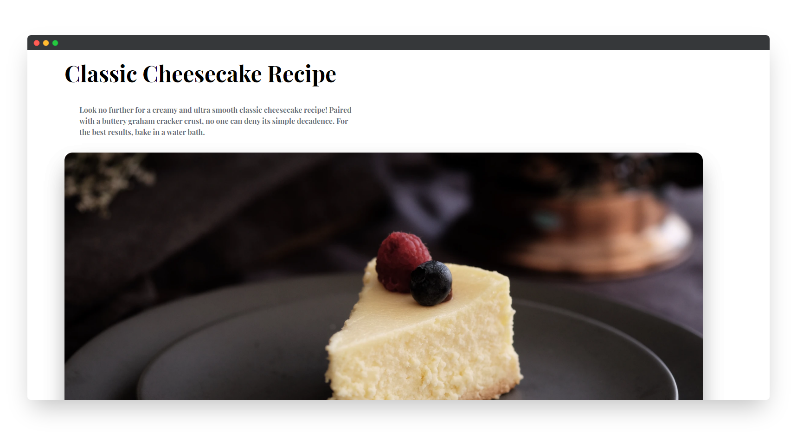

<!-- Please update value in the {}  -->

<h1 align="center">Interior consultant</h1>

   Solution for a challenge from  <a href="http://devchallenges.io" target="_blank">Devchallenges.io</a>.

  <h3>
    <a href="https://fervent-johnson-6351fc.netlify.app/">
      Demo
    </a>
    | 
      <a href="https://devchallenges.io/solutions/7g7oaOzpT4ZI9lzdjwPw">
         solution
      </a>
    | 
    <a href="https://devchallenges.io/challenges/OEKdUZ6xs0h99C38XVht">
      Challenge
    </a>
  </h3>

<!-- TABLE OF CONTENTS -->

## Table of Contents

- [Overview](#overview)
  - [Built With](#built-with)
      [HTML, TAILWINDCSS AND DAISYUI]

      

<!-- OVERVIEW -->

## Overview

- Where can I see your demo?
      on https://fervent-johnson-6351fc.netlify.app/
- What was your experience?
      it was fun
- What have you learned/improved? 
      i improve my copy and paste skills!
- Your wisdom : "learn to copy and paste a block of code properly." 

## Acknowledgements

<!-- This section should list any articles or add-ons/plugins that helps you to complete the project. This is optional but it will help you in the future. For exmpale -->

- [TailwindCSS]
      [DaisyUI]
      
## Contact

- Twitter [@Ameeeekk](https://twitter.com/Ameeeekk})
- Facebook [Amek](https://www.facebook.com/ameeek.code/)
